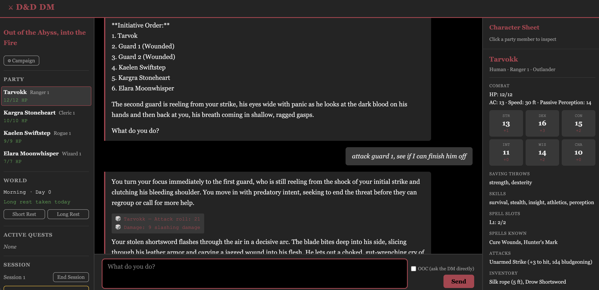

# D&D Dungeon Master



A local, agentic AI Dungeon Master for D&D 5e. It runs actual game sessions —
narrating, adjudicating rules, rolling dice, and tracking every character's HP,
inventory, and initiative order — grounded in real rulebook/monster/spell data
via retrieval rather than improvising mechanics from a language model's guesses.
Runs entirely on local models (Ollama); no cloud LLM required.

## Why this is interesting (agentic AI engineering)

This isn't a chatbot wrapper — it's a multi-node [LangGraph](https://github.com/langchain-ai/langgraph)
agent built around the idea that an LLM DM's *mechanics* and *prose* are different
jobs with different failure modes, and that a smaller local model needs real
guardrails, not just a good prompt.

- **Two-model split, one graph.** A tool-calling "mechanics" node (low
  temperature, no prose) resolves dice rolls, rule lookups, and every state
  change, then hands off a terse resolution report to a "narrator" node
  (high temperature, no tools) that turns it into prose. The narrator
  physically cannot invent an outcome the mechanics node didn't actually apply
  — see `backend/agent/dm_agent.py`.
- **Self-correcting guardrails, not just prompts.** A local model doesn't
  reliably follow multi-step instructions every time. Rather than trusting the
  prompt alone, the mechanics node runs small detector functions after each
  turn — `_detect_missing_followup`, `_detect_missing_loot_followup`,
  `_detect_missing_encounter_followup` (`backend/agent/dm_agent.py`) — that
  catch a skipped tool call (e.g. combat resolved with no formal encounter
  state, loot narrated with no inventory change) and feed a one-shot corrective
  nudge back into the same turn. Where a soft nudge isn't enough, invariants
  are enforced as hard tool-level refusals instead — e.g. `require_current_turn`
  (`backend/tools/_helpers.py`) refuses an attack roll from a character whose
  turn it isn't, rather than hoping the model gets initiative order right.
- **RAG-grounded rules, not invented ones.** `search_rules`
  (`backend/tools/rules.py`) retrieves real rulebook/monster/spell text from a
  ChromaDB index (`backend/stores/rules_store.py`) built from OCR'd source
  material — the agent is instructed to cite what it finds or explicitly label
  a ruling as DM improvisation, never present an invented stat block as fact.
- **Structured game state as the only source of truth.** HP, inventory,
  initiative order, quest and NPC state all live in real persisted Pydantic
  models (`backend/models.py`), mutated only through tool calls — never
  inferred from the model's own narrated memory of what happened last turn.

See [`design.md`](design.md) for the full architecture write-up (tech stack,
45+ agent tools, data model, agent graph, datastores).

## Engineering practices

There's no automated test suite for this project by design choice — an LLM
agent's correctness is largely behavioral (did it call the right tool at the
right time?), not something a unit test can fully capture. Instead:

- [`docs/BEHAVIOR.md`](docs/BEHAVIOR.md) — Given/When/Then scenarios
  specifying the agent's intended behavior, the closest equivalent to a test
  spec for a probabilistic system.
- [`docs/VERIFICATION.md`](docs/VERIFICATION.md) — how those scenarios are
  actually checked: live playtesting against a running instance, checking
  real persisted state, not just narrated prose.
- [`docs/engineering-notes/`](docs/engineering-notes/) — a dated internal
  code-review pass and what came of it, kept as a record rather than
  discarded once resolved.

## Quickstart

Requires Docker and [Ollama](https://ollama.com) running on the host (Docker
Desktop reaches it via `host.docker.internal`; see `docker-compose.yml` for
Linux networking notes).

```bash
cp .env.example .env        # fill in only what you need to override
ollama pull gemma4:26b-mlx  # or your preferred model — see .env.example
ollama pull nomic-embed-text
make up                     # start Postgres + the app
make setup                  # run migrations, build the RAG index if empty
```

Then visit `http://localhost:8000`.

**Rulebook content isn't included.** `docs/source/` (the OCR'd rules/adventure
text the RAG index is built from) is gitignored — it's copyrighted content and
isn't redistributed here. To populate your own index from legally-owned PDFs,
see `scripts/ocr_ingest.py` → `scripts/clean_source.py` →
`scripts/validate_source.py` → `scripts/build_index.py` (the full pipeline is
documented in `design.md`'s "Prep Scripts" section). Without it, the app runs
but `search_rules` has nothing to retrieve.

See the [Makefile](Makefile) for the rest of the day-to-day commands
(`logs`, `psql`, `shell`, `migration`, `fresh`, ...).

## Status

Session 0 (character creation), full combat/exploration play, RAG-grounded
rules and adventure content, session summarization/continuity, and a working
web UI are all in place. See `design.md`'s own "Status" and "Feature
Brainstorm" sections for what's shipped versus planned.

## License

[MIT](LICENSE) — for the code in this repository. It does not cover any
third-party rulebook/adventure content, which isn't included (see Quickstart).
